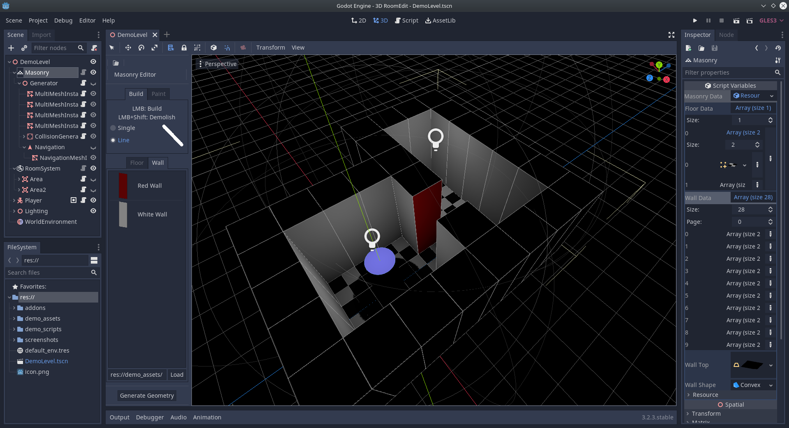

# godot-3d-room-edit
A 3d Room Leveleditor designed for topdown view games and high performance.

## Background
This 3 Tools where originally created to be used in a 3d topdown game.
I decoupled the plugins and combined them in this repository so everyone can use them.

## This repositroy includes ...
MasonryEditor: Create Walls and Floors with your own .obj files and generate high performing MultiMeshes with Collision directly in the Editor.
RoomSystem: A tool to help you with 3d topdown Rooms. Just paint the area in the ditor and generate the CameraSystem with one click!
ToolCore: This is jsut the core for the two Plugins listed above. You may find it helpful when you create your own Editors which are used in the 3d Space.
Demo: A simple demo to show you how a finished Level can look like when build with this plugin.

## Cuntributions are welcome!
As well as feedback :)
